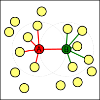
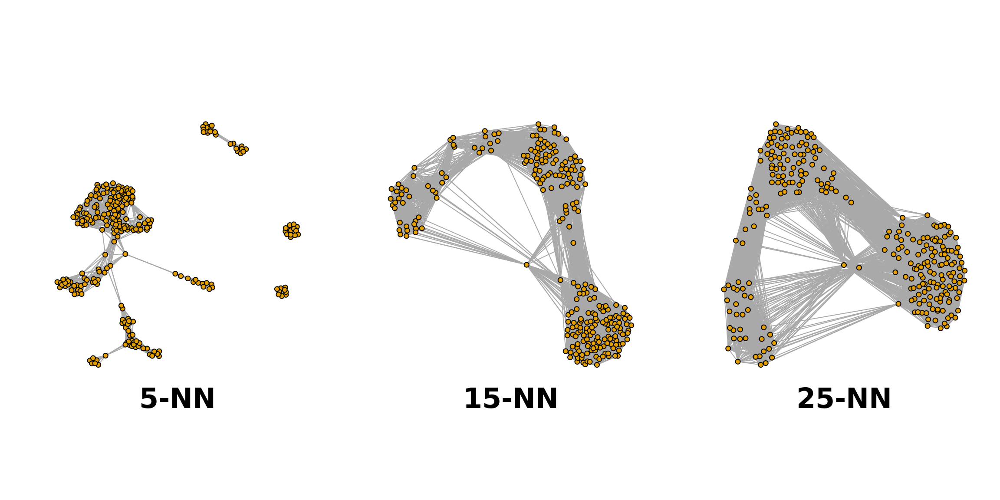
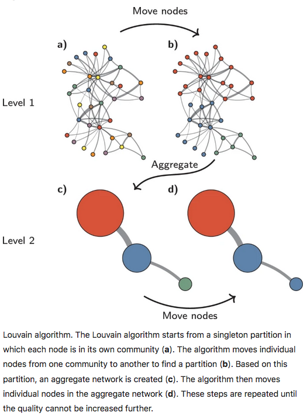
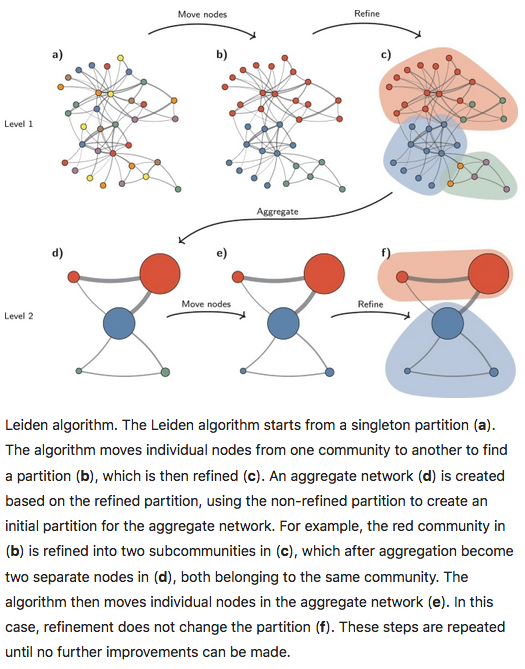

# Clustering

```{r setup, include=FALSE, purl=FALSE}
# Move all the course files to the `course_files` folder
# This setup makes sure the working directory is set to this folder
# All paths are relative to it, so participant scripts work when we purl it
knitr::opts_chunk$set(echo = TRUE,
                      root.dir = here::here("course_files"))
knitr::opts_knit$set(root.dir = here::here("course_files"))
set.seed(123)
```

Once we have normalized the data and removed confounders we can carry out
analyses that are relevant to the biological questions at hand. The exact nature
of the analysis depends on the data set. One of the most promising applications
of scRNA-seq is *de novo* discovery and annotation of cell-types based on
transcription profiles. This requires the identification of groups of cells
based on the similarities of the transcriptomes without any prior knowledge of
the label a.k.a. unsupervised clustering. To avoid the challenges caused by the
noise and high dimensionality of the scRNA-seq data, clustering is performed
after feature selection and dimensionality reduction. For data that has not 
required batch correction this would usually be based on the PCA output. As our data has
required batch correction we will use the "corrected" reducedDims data.

We will focus here on graph-based clustering, however, it is also possible to apply
hierarchical clustering and k-means clustering on smaller data sets - see the
[OSCA
book](http://bioconductor.org/books/release/OSCA.basic/clustering.html#vector-quantization-with-k-means)
for details. Graph-base clustering is a more recent development and better
suited for scRNA-seq, especially large data sets.

```{r libraries}
# Load libraries
library(Seurat)
library(sctransform)
library(glmGamPoi)
library(cluster) # for silhouette function
library(tidyverse)
library(patchwork)

# set default ggplot theme
theme_set(theme_classic())
```

## Load the data

We will load our integrated seurat object that we created in the previous section. The data has been QC'd, downsampled to 500 cells per sample, normalized, batch corrected and dimensionality reduced. We are now ready to carry out clustering of the data to begin to add our biological context. 

```{r loadData}
# Load the data
seurat_object <- readRDS("RObjects/DI.500.rds")

# Confirm the default assay is set to SCT
DefaultAssay(seurat_object)
```

## Graph-based clustering overview

Graph-based clustering entails building a nearest-neighbour (NN) graph using
cells as nodes and their similarity as edges, then identifying 'communities' of
cells within the network. A graph-based clustering method has three key
parameters:

* How many neighbors are considered when constructing the graph  
* What scheme is used to weight the edges   
* Which community detection algorithm is used to define the clusters

### Connecting nodes (cells) based on nearest neighbours

Two types of NN graph may be used: "K nearest-neighbour" (KNN) and "shared
nearest-neighbour" (SNN). In a KNN graph, two nodes (cells), say A and B, are
connected by an edge if the distance between them is amongst the *k* smallest
distances from A to other cells. In an SNN graph A and B are connected if the
distance is amongst the *k* samllest distances from A to other cells and also
among the *k* smallest distance from B to other cells.

{width=40%}

In the figure above, if *k* is 5, then A and B would be connected in a KNN graph
as B is one of the 5 closest cells to A, however, they would not be connected in
an SNN graph as B has 5 other cells that are closer to it than A.

The value of *k* can be roughly interpreted as the anticipated size of the
smallest subpopulation" (see [`scran`'s `buildSNNGraph()`
manual](https://rdrr.io/bioc/scran/man/buildSNNGraph.html)).

The plot below shows the same data set as a network built using three different
numbers of neighbours: 5, 15 and 25 (from
[here](https://biocellgen-public.svi.edu.au/mig_2019_scrnaseq-workshop/clustering-and-cell-annotation.html#example-1.-graph-based-clustering-deng-dataset)).



### Weighting the edges

The edges between nodes (cells) can be weighted based on the similarity of the
cells; edges connecting cells that are more closely related will have a higher
weight. The three common methods for this weighting are (see [the *bluster* 
package documentation for the `makeSNNGraph` function](https://rdrr.io/github/LTLA/bluster/man/makeSNNGraph.html)):

* **rank** - the weight is based on the highest rank of the shared nearest
neighbours  
* **number** - the weight is based the number of nearest neighbours in common
between the two cells  
* **jaccard** - the [Jaccard index](https://en.wikipedia.org/wiki/Jaccard_index) 
of the two cells' sets of nearest neighbours.  

### Grouping nodes (cells) into clusters

Clusters are identified using an algorithm that interprets the connections
of the graph to find groups of highly interconnected cells. A variety of
different algorithms are available to do this, in these materials we will focus
on two methods: louvain and leiden. See the [OSCA
book](http://bioconductor.org/books/release/OSCA.basic/clustering.html#overview-1)
for details of others available in *Seurat*.

### Modularity

Several methods to detect clusters ('communities') in networks rely on a metric
called "modularity". For a given partition of cells into clusters, modularity
measures how separated clusters are from each other, based on the difference
between the observed and expected weight of edges between nodes. For the whole
graph, the closer to 1 the better.

### Pros and Cons of graph based clustering

* Pros:
    + fast and memory efficient (avoids the need to construct a distance matrix
    for all pairs of cells)
    + no assumptions on the shape of the clusters or the distribution of cells
    within each cluster
    + no need to specify a number of clusters to identify (but the size of the
    neighbourhood used affects the size of clusters)
* Cons:
    + loss of information beyond neighboring cells, which can affect community detection in regions with many cells.

## Clustering with Seurat

<!-- Note: this code chunk is here so we purl it into the participant script -->
```{r include=FALSE}

#### Clustering ####
```

In `Seurat` we have two functions to carry out graph-based clustering: `FindNeighbors()` and `FindClusters()`. The former constructs the nearest neighbour graph and the latter identifies clusters within the graph.

The `FindNeighbors()` function computes the nearest neighbours in our dataset using a Shared Nearest Neighbour graph based on the dimensionality reduction specified by the `reduction` parameter and the number of nearest neighbours specified by the `k.param` parameter. Since we have batch corrected our data we should use the harmony correct reduction for this. If we had chosen not to batch correct we would use the PCA output. We can also set the number of reduced dimmensions that are used. We will use the first 15.

The main parameter we will adjust here is the value of `k`. `k` is the number of nearest neighbours to consider when constructing the graph. The default is 20, but we will experiment with this value to find the best fit for our data. A smaller value of k will lead to more clusters, while a larger value will lead to fewer clusters.

```{r findNeighbors}
# construct the neighbour graph, by default it constructs both:
#   - nearest neighbour (NN) graph
#   - shared nearest neighbour (SNN) graph
seurat_object <- FindNeighbors(seurat_object,
                               reduction = "harmony",
                               k.param = 20, # k = 20 is the default
                               dims = 1:15)

# Check the graphs slot
Graphs(seurat_object)
```

The `FindClusters()` function identifies clusters in the nearest neighbour graph using a community detection algorithm. The `resolution` parameter controls the granularity of the clustering, with higher values leading to more clusters. The default is 0.8, but again we will experiment with this value to find the best fit for our data. Using the `cluster.name` argument allows us to set the column name that will appear in the meta.data slot of our object.

```{r findClusters}
# identify clusters in the nearest neighbour graph (SNN used by default)
seurat_object <- FindClusters(seurat_object,
                              resolution = 0.8, # default is 0.8
                              algorithm = 1, # default is 1 (louvain)
                              cluster.name = "Louvain_k20_res0.8")

# confirm the new column in the meta.data slot
head(seurat_object[[]])
```

There are many different community detection algorithms available, and the `algorithm` parameter allows us to choose which one to use of those avaliable in Seurat. The default is 1 (louvain), but we can also choose leiden (4). The choice of algorithm can affect the number and composition of clusters identified, so it may be worth trying different algorithms to see which one gives the best results for your data.

### The Louvain method

With the Louvain method, nodes are first assigned their own community. This
hierarchical agglomerative method then progresses in two-step iterations: 

1. nodes are re-assigned one at a time to the community for which they increase
modularity the most, if at all. 
2. a new, 'aggregate' network is built where nodes are the communities formed in
the previous step.

These two steps are repeated until modularity stops increasing. The diagram
below is copied from [this
article](https://www.nature.com/articles/s41598-019-41695-z#Fig1).



```{r louvain}
# visualise the clusters on a UMAP plot
DimPlot(seurat_object, 
        reduction = "umap", 
        group.by = "Louvain_k20_res0.8")
```

### Exercise 1

:::exercise

Experiment with different values of `k` and `resolution` parameters in the `FindNeighbors()` and `FindClusters()` functions, respectively. How do these parameters affect the number and composition of clusters identified? Try to find a combination of parameters that gives you a reasonable number of clusters that are well-separated in the UMAP plot.

1. Start with resolution, try 0.4 and 1.6
2. Then try different values of k, try 10 and 40

Give them sensible names using the cluster.name argument. How do they alter your clusterings as displayed on your UMAP?

<!-- Note: this code chunk is here so we purl it into the participant script -->
```{r include=FALSE}

#### Exercise: Try different parameter combinations ####
# Experiment with different values of `k` and `resolution`

# Cluster with resolution 0.4 using the previous k value of 20
# YOUR CODE HERE

# Cluster with resolution 1.6 using the previous k value of 20
# YOUR CODE HERE

# Find neighbours with k = 10 and cluster with resolution 0.8
# YOUR CODE HERE

# Find neighbours with k = 40 and cluster with resolution 0.8
# YOUR CODE HERE
```


<details><summary>Answer</summary>

```{r exercise1_1, purl=FALSE}
# Cluster with resolution 0.4
seurat_object <- FindClusters(seurat_object,
                              resolution = 0.4,
                              algorithm = 1,
                              cluster.name = "Louvain_k20_res0.4")

# Cluster with resolution 0.4
seurat_object <- FindClusters(seurat_object,
                              resolution = 1.6,
                              algorithm = 1,
                              cluster.name = "Louvain_k20_res1.6")

# Visualise the clusters on a UMAP plot
DimPlot(seurat_object, reduction = "umap",
        group.by = c("Louvain_k20_res0.4", "Louvain_k20_res0.8",
                     "Louvain_k20_res1.6"))
```

```{r exercise1_2, purl=FALSE}
# Find neighbours with k = 10
seurat_object <- FindNeighbors(seurat_object,
                               reduction = "harmony",
                               k.param = 10,
                               dims = 1:15)

# Cluster with resolution 0.8
seurat_object <- FindClusters(seurat_object,
                              resolution = 0.8,
                              algorithm = 1,
                              cluster.name = "Louvain_k10_res0.8")

# Find neighbours with k = 40
seurat_object <- FindNeighbors(seurat_object,
                               reduction = "harmony",
                               k.param = 40,
                               dims = 1:15)

# Cluster with resolution 0.8
seurat_object <- FindClusters(seurat_object,
                              resolution = 0.8,
                              algorithm = 1,
                              cluster.name = "Louvain_k40_res0.8")

# Visualise the clusters on a UMAP plot
DimPlot(seurat_object, reduction = "umap",
        group.by = c("Louvain_k10_res0.8", "Louvain_k20_res0.8",
                     "Louvain_k40_res0.8"))
```

</details>

:::

### The Leiden method

The Leiden method improves on the Louvain method by guaranteeing that at each
iteration clusters are connected and well-separated. The method includes an
extra step in the iterations: after nodes are moved (step 1), the resulting
partition is refined (step2) and only then the new aggregate network made, and
refined (step 3). The diagram below is copied from [this
article](https://www.nature.com/articles/s41598-019-41695-z#Fig3).



### Exercise 2

:::exercise

Repeat the clustering using the Leiden method (algorithm = 4) and compare the results to the Louvain method. Do you see any differences in the clusters identified? 

Use the `random.seed` argument to set a seed when you use the Leiden algorithm as the default in this function is 0 and that will give a warning.


<!-- Note: this code chunk is here so we purl it into the participant script -->
```{r include=FALSE}

#### Exercise: Leiden clustering ####
# Repeat the clustering using the Leiden method (algorithm = 4)

# Find neighbours with k = 20 and cluster with resolution 0.8 using the Leiden method
# YOUR CODE HERE

# Visualise the clusters on a UMAP plot
# YOUR CODE HERE
```


<details><summary>Answer</summary>

```{r exercise2, purl=FALSE}
# Find neighbours with k = 20
seurat_object <- FindNeighbors(seurat_object,
                               reduction = "harmony",
                               k.param = 20,
                               dims = 1:15)

# Cluster with resolution 0.8 using the Leiden method
seurat_object <- FindClusters(seurat_object,
                              resolution = 0.8,
                              algorithm = 4,
                              cluster.name = "Leiden_k20_res0.8",
                              random.seed = 123) # set seed (warning without)

# Visualise the clusters on a UMAP plot
DimPlot(seurat_object, reduction = "umap",
        group.by = c("Louvain_k20_res0.8", "Leiden_k20_res0.8"))
```

</details>

:::

### Testing multiple resolutions

<!-- Note: this code chunk is here so we purl it into the participant script -->
```{r include=FALSE}

#### Testing multiple resolutions ####
```

The `FindClusters` function also allows you to test multiple resolution values in a single run. You can simply put in multiple values in the resolution argument. This can be useful for quickly comparing the results of different resolutions and finding the best fit for your data. 
It names them as `<assay>_<graph>_res<resolution_value>`, so you can easily identify which clustering corresponds to which resolution.

```{r multipleResolutions}
# FindClusters supports testing multiple resolution values in a single run
seurat_object <- FindClusters(seurat_object,
                              resolution = c(0.4, 0.8, 1.6, 2.0),
                              algorithm = 1)

# Confirm the new columns in the meta.data slot
# named: SCT_snn_res<resolution_value>
head(seurat_object[[]])
```

### Testing multiple values for k

<!-- Note: this code chunk is here so we purl it into the participant script -->
```{r include=FALSE}

#### Testing multiple k ####
```


Testing multiple values for k is a bit more involved as you need to re-run the `FindNeighbors` function for each value of k. You can write a loop to do this, or you can use the `lapply` function to apply the `FindNeighbors` and `FindClusters` functions to a list of k values.

```{r multipleK}
# Testing multiple values for k with a for loop
k_values <- c(5, 10, 15, 20, 25)

# For each value of k, run FindNeighbors and FindClusters
for (k in k_values) {
  seurat_object <- FindNeighbors(seurat_object,
                                 reduction = "harmony",
                                 k.param = k,
                                 dims = 1:15)
  
  seurat_object <- FindClusters(seurat_object,
                                resolution = 0.8,
                                algorithm = 1,
                                cluster.name = paste0("Louvain_k", k,
                                                      "_res0.8"))
}
colnames(seurat_object[[]])
```


```{r bluster, include=FALSE, eval=FALSE, purl=FALSE}
# Alternative with bluster
# not shown, here in case we want to include in the future
library(bluster)

# unfortunately, the cluster.args argument works
# but the output columns are named in a way that is not easy to identify which is which
clust_sweep <- clusterSweep(
  Embeddings(seurat_object[["harmony"]])[, 1:15],
  BLUSPARAM = SNNGraphParam(),
  k = as.integer(c(10, 20)),
  cluster.fun = "leiden",
  cluster.args = list(resolution = c(0.4, 0.8, 1.2))
)

# add the cluster assignments to the seurat object
seurat_object[[]] <- cbind(seurat_object[[]], clust_sweep$clusters)
```

## Assessing cluster behaviour

<!-- Note: this code chunk is here so we purl it into the participant script -->
```{r include=FALSE}

#### Assessing cluster behaviour ####
```


A variety of metrics are available to aid us in assessing the behaviour of a 
particular clustering method on our data. These can help us in assessing how
well defined different clusters within a single clustering are in terms of
the relatedness of cells within the cluster and the how well separated that
cluster is from cells in other clusters, and to compare the results of 
different clustering methods or parameter values (e.g. different values
for *k*).

We will consider "Silhouette width" as it is the most commonly used. Further details and 
other metrics are described in the ["Advanced" section of the OSCA book](http://bioconductor.org/books/release/OSCA.advanced/clustering-redux.html#quantifying-clustering-behavior).

### Silhouette width

The silhouette width (so named after the look of the traditional graph for
plotting the results) is a measure of how closely related cells within cluster
are to one another versus how closely related cells in the cluster are to cells
in other clusters. This allows us to assess cluster separation.

For each cell in the cluster we calculate the the average distance to all other
cells in the cluster and the average distance to all cells in the next closest cluster.
The cells silhouette width is the difference between these divided by the
maximum of the two values. Cells with a large silhouette are strongly related to
cells in the cluster, cells with a negative silhouette width are more closely
related to other clusters.

```{r silhouette}
# get Harmony data as we used for clustering
harmony_data <- Embeddings(seurat_object, reduction = "harmony")[, 1:15]

# calculate distance matrix for the harmony data
harmony_dist <- dist(harmony_data)

# get our choice of cluster assignments
# because it's a factor, we convert it to integer
clusters <- seurat_object$Louvain_k20_res0.8
clusters <- as.integer(as.character(clusters))

# calculate silhouette width for each cell
silhouette_width <- silhouette(clusters,
                               harmony_dist) %>%
  # convert to data frame for plotting
  as_tibble()

# look at the top 15 rows
head(silhouette_width, n = 15)
```

On this table, we can see that some cells have a negative silhouette width, meaning they are more close (in terms of euclidean distance) to cells in other clusters than to cells in their own cluster. 

We can plot the silhouette widths for each cell to visualise this, colouring them by their own cluster (if silhouette width is positive) or the closest cluster (if negative).

```{r silhouettePlots}
# silhouette width distribution coloured by closest cluster
p1 <- silhouette_width %>%
  # create variable for closest cluster based on silhouette width
  mutate(closest_cluster = ifelse(sil_width > 0, cluster, neighbor)) %>%
  ggplot(aes(x = factor(cluster), 
             y = sil_width, 
             colour = factor(closest_cluster))) +
  ggbeeswarm::geom_quasirandom() +
  labs(x = "Cluster", 
       y = "Silhouette width", 
       colour = "Closest cluster")

# UMAP plot for comparison
p2 <- DimPlot(seurat_object,
              reduction = "umap",
              group.by = "Louvain_k20_res0.8",
              label = TRUE) +
  NoLegend()
  
# plot them together
p1 + p2
```

We can use this to compare with the Leiden clustering we did in the previous exercise.

<!-- Note: this code chunk is here so we purl it into the participant script -->
```{r leiden_k20_res0.8, include=FALSE}

#### Silhouette width for Leiden clustering ####

# In case you didn't complete the previous exercise, make sure to run
# clustering with leiden, k = 20, resolution = 0.8
seurat_object <- FindNeighbors(seurat_object,
                               reduction = "harmony",
                               k.param = 20,
                               dims = 1:15)
seurat_object <- FindClusters(seurat_object,
                              resolution = 0.8,
                              algorithm = 4,
                              cluster.name = "Leiden_k20_res0.8",
                              random.seed = 123) # set seed (warning without)

```

```{r silhouetteLeiden}
# get our choice of cluster assignments
clusters_leiden <- seurat_object$Leiden_k20_res0.8
clusters_leiden <- as.integer(as.character(clusters_leiden))

# calculate silhouette width for each cell
silhouette_width_leiden <- silhouette(clusters_leiden,
                                      harmony_dist) %>%
  # convert to data frame for plotting
  as_tibble()

# silhouette width distribution coloured by closest cluster
p1_leiden <- silhouette_width_leiden %>%
  # create variable for closest cluster based on silhouette width
  mutate(closest_cluster = ifelse(sil_width > 0, cluster, neighbor)) %>%
  ggplot(aes(x = factor(cluster), 
             y = sil_width, 
             colour = factor(closest_cluster))) +
  ggbeeswarm::geom_quasirandom() +
  labs(x = "Cluster", 
       y = "Silhouette width", 
       colour = "Closest cluster")

# UMAP plot for comparison
p2_leiden <- DimPlot(seurat_object,
                     reduction = "umap",
                     group.by = "Leiden_k20_res0.8")

# plot them together
p1_leiden + p2_leiden
```

### Mean silhouette width

When we are comparing a lot of potential clustering possibilities it can be useful to summarise the silhouette widths for the whole clustering. The mean silhouette width is a measure of how well separated the clusters are from each other. A higher mean silhouette width indicates that the clusters are more well-defined and separated from each other, while a lower mean silhouette width indicates that the clusters are less well-defined and may be overlapping. So we want to find a clustering that maximises this whilst also giving us a reasonable number of clusters.


### Comparing silhouette widths across different values of k

```{r meanSilhouette}
#### Calculate mean silhouette width for different values of k ####

# function to calculate mean silhouette width for a given clustering
calc_mean_sil <- function(clusters, dist_matrix) {
  silhouette_width <- silhouette(clusters, dist_matrix)
  mean(silhouette_width[, "sil_width"])
}

# function to calculate number of clusters for a given clustering
calc_num_clusters <- function(clusters) {
  length(unique(clusters))
}

# list of k-values we're interested in
k_values <- c(5, 10, 15, 20, 25)

# get the seurat metadata for convenience
seurat_meta <- seurat_object[[]]

# calculate mean silhouette width and number of clusters for each k
# the lapply() function loops through each k value
# and applies the code inside the function 
silhouette_stats <- lapply(k_values, function(k) {
  # column name for the clustering with this k value
  cluster_col <- paste0("Louvain_k", k, "_res0.8")
  
  # get the cluster assignments for this k value
  clusters <- seurat_meta[, cluster_col]
  
  # convert to integer
  clusters <- as.integer(as.character(clusters))
  
  # create a data frame to store the results
  tibble(k = k,
         num_clusters = calc_num_clusters(clusters),
         mean_silhouette_width = calc_mean_sil(clusters, harmony_dist))
}) %>%
  # bind the list into a single data frame
  bind_rows()
  
# look at the results
silhouette_stats
```

This is must easier viewed as a plot

```{r silhouette2}
# Mean silhouette plot
p_mean_sil <- silhouette_stats %>%
  ggplot(aes(x = k, y = mean_silhouette_width)) +
  geom_line(lwd = 2)

# Number of clusters plot
p_num_clusters <- silhouette_stats %>%
  ggplot(aes(x = k, y = num_clusters)) +
  geom_line(lwd = 2)

# plot them together
p_num_clusters + p_mean_sil
```

### Exercise 3

:::exercise

Have a play with K, Resolution and the two algorithms and compare the results using silhouette widths. Can you find a combination of parameters that gives you a reasonable number of clusters that are well-separated in the UMAP plot?


<!-- Note: this code chunk is here so we purl it into the participant script -->
```{r include=FALSE}

#### Exercise: test different parameter combinations ####

# Test a combination of resolution and k values
# For example k = 10, 14, 17, 20, 25
# and resolution = 0.6, 0.8, 1.0, 1.2, 1.4, 1.6

# Test different k values first, clustering with Leiden with resolution 0.8
# YOUR CODE HERE

# Test different clustering resolution values using Leiden with k = 17
# YOUR CODE HERE
```


<details><summary>Answer</summary>

Although the exercise suggested testing k and resolution separately, it can be useful to test them together as they can interact with each other.

Therefore, the answer shown here shows a somewhat exhaustive testing of different values of k and resolution, and comparing the results using silhouette widths. 
The code is a bit long, but it is a good example of how to systematically test different parameter combinations and compare the results.

You may not need to do such an exhaustive sweep of parameters, but it can be useful to get a sense of how different parameters affect the results and to find a good combination for your data.

```{r cluster_sweep_answer, purl=FALSE, message=FALSE, warning=FALSE, results="hide"}
# Test a combination of resolution and k values
# make all parameter combinations using the crossing() function
# this results in many combinations - it will take a while to run!
params <- crossing(algorithm = c(1, 4),
                   k = seq(10, 22, by = 2),
                   resolution = seq(0.6, 1.6, by = 0.2))

# loop through each row of params and calculate cluster statistics
cluster_param_sweep <- lapply(1:nrow(params), function(i) {
  alg <- params$algorithm[i]
  k <- params$k[i]
  res <- params$resolution[i]
  clust_name <- paste0("Alg", alg, "_k", k, "_res", res)
  
  # Find neighbors and clusters for this combination of parameters
  seurat_object <- FindNeighbors(seurat_object,
                                 reduction = "harmony",
                                 k.param = k,
                                 dims = 1:15)
  
  seurat_object <- FindClusters(seurat_object,
                                resolution = res,
                                algorithm = alg,
                                random.seed = 123,
                                cluster.name = clust_name)
  
  clusters <- seurat_object[[clust_name]] %>%
    pull() %>%
    as.character() %>%
    as.integer()
  
  tibble(algorithm = alg,
         k = k,
         resolution = res,
         mean_silhouette_width = calc_mean_sil(clusters, harmony_dist),
         num_clusters = calc_num_clusters(clusters))
}) %>%
  # bind the list into a single data frame
  bind_rows() %>%
  # make algorithm name more reaadable
  mutate(algorithm = ifelse(algorithm == 1, "Louvain", "Leiden"))
```

```{r cluster_sweep_results, purl=FALSE}
# look at the results
head(cluster_param_sweep)
```

With this table, we can make plots to compare the mean silhouette width and number of clusters for each combination of parameters. 
We can colour the lines by resolution and use different line types for the two algorithms.

```{r cluster_sweep_plots, purl=FALSE}
p_mean_sil_sweep <- cluster_param_sweep %>%
  ggplot(aes(x = k,
             y = mean_silhouette_width,
             colour = factor(resolution))) +
  geom_line(lwd = 1) +
  geom_vline(xintercept = 17) +
  facet_grid(rows = vars(algorithm)) +
  labs(x = "k (number of nearest neighbours)",
       y = "Mean silhouette width",
       colour = "Resolution") +
  scale_x_continuous(breaks = seq(5, 30, by = 2))
  
p_num_clusters_sweep <- cluster_param_sweep %>%
  ggplot(aes(x = k, 
             y = num_clusters, 
             colour = factor(resolution))) +
  geom_line(lwd = 1) +
  geom_vline(xintercept = 17) +
  facet_grid(rows = vars(algorithm)) +
  labs(x = "k (number of nearest neighbours)",
       y = "Number of clusters",
       colour = "Resolution") +
  scale_x_continuous(breaks = seq(5, 30, by = 2))
  
# plot them together
p_num_clusters_sweep + p_mean_sil_sweep +
  plot_layout(guides = "collect")
```

**So, which combination of parameters is best?**

From this exploration, we can see that a higher resolution seems to give us lower average silhouette width, and a higher number of clusters. 
This may suggest that a higher resolution is overfitting the data, giving us more clusters than are really there, and that these clusters are not well separated.

A higher number of neighbours (k) seems to give us a higher average silhouette width, and a lower number of clusters. 
However, this seems to plateau around k = 15. 
This may suggest that a higher k is underfitting the data, giving us fewer clusters than are really there, but that these clusters are more well separated.

As you can see from these plots, there is no single "best" combination of parameters, as the lines start converging. 
And so the choice of parameters at the end can be slightly subjective.
In our case, we will choose the Leiden algorithm with k = 17 and resolution = 1 as a reasonable combination that gives us a good number of clusters that are well separated in the UMAP plot.

</details>

:::

## Finalise the clustering

<!-- Note: this code chunk is here so we purl it into the participant script -->
```{r include=FALSE}

#### Finalise the clustering ####
```

After our exploration in the exercise, we chose the Leiden algorithm with k = 17 and resolution = 1 as a reasonable combination that gives us a good number of clusters that are well separated in the UMAP plot. 

We will make sure this clustering is added to our Seurat object, and visualise it on the UMAP plot.

```{r k17res1}
# Add our final choice of clustering to the seurat object
# Create SNN graph with k = 17
seurat_object <- FindNeighbors(seurat_object,
                               reduction = "harmony",
                               k.param = 17,
                               dims = 1:15)

# Cluster cells with resolution = 1 using the Leiden method
seurat_object <- FindClusters(seurat_object,
                              resolution = 1,
                              algorithm = 4,
                              random.seed = 123,
                              cluster.name = "Leiden_k17_res1")

# Visualise the clusters on a UMAP plot
DimPlot(seurat_object, 
        reduction = "umap", 
        group.by = "Leiden_k17_res1")
```

Having identified clusters, we now display the level of expression of cell type marker genes to quickly match clusters with cell types. For each marker we will plot its expression on a t-SNE, and show distribution across each cluster on a violin plot.

```{r markerPlots}
# Visualise the expression of a marker gene on the UMAP plot and across clusters
fplot <- FeaturePlot(seurat_object, 
                     features = "HBA1", 
                     reduction = "umap")

# visualise the distribution of expression across clusters
vplot <- VlnPlot(seurat_object, features = "HBA1",
                 group.by = "Leiden_k17_res1",
                 pt.size = 0) + 
  NoLegend()

# plot them together
fplot + vplot
```

----

<details><summary>`sessionInfo()`</summary>

```{r session_info, echo=FALSE, purl=FALSE}
sessionInfo()
```

</details>

