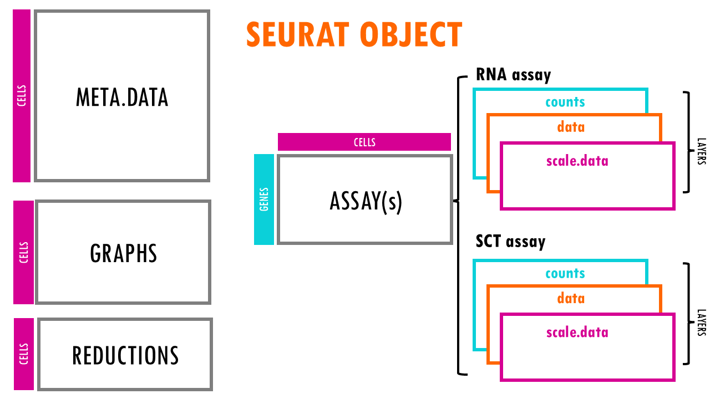

<style type="text/css">
slides > slide:not(.nobackground):after {
  content: '';
}
</style>

## Single Cell RNAseq Analysis Workflow

```{r echo=FALSE, out.width='60%', fig.align='center'}
knitr::include_graphics('../Images/workflow2_QC.png')
```

## 10x overview

<div style="width: 75%; float: top; padding-left: 10%; padding-top: 10%">

</div>

<div style="width: 100%; float: bottom; padding-top: 20%">
Image source: https://web.genewiz.com/single-cell-faq
</div>

## Not every droplet is useble

```{r echo=FALSE, out.width='100%', fig.align='center', out.height='80%'}
knitr::include_graphics('../Images/droplet_overview.png')
```

## Quality Control overview

<div style="width: 55%; float: left;">
* Aim of QC is ...
  * To remove undetected genes
  * To remove empty droplets
  * To remove droplets with dead cells
  * To remove Doublet/multiplet 
  * Ultimately To filter the data to only include true cells that are of high quality 

* Above is achieved by ...

  * Applying hard cut-off or adaptive cut-off on ...
    * Number of genes detected per cell
    * Percent of mitochondrial genes per cell
    * Number of UMIs/transcripts detected per cell
    
</div>

## Quality Control

<div style="width: 80%; float: left;">

**Seurat (v5)**
_Hao, Y., Stuart, T., Kowalski, M.H. et al._

Take care of version differences!

https://satijalab.org/seurat/

**Orchestrating Single-Cell Analysis with Bioconductor**
_Robert Amezquita, Aaron Lun, Stephanie Hicks, Raphael Gottardo_

http://bioconductor.org/books/release/OSCA/

**Single-Cell Best Practices**
_Heumos, L., Schaar, A.C., Lance, C. et al._

https://www.sc-best-practices.org/preamble.html


</div>


## Read CellRanger outputs into R

<div style="width: 80%; float: left;">
* CellRanger outputs: gives two output folders raw and filtered 

* Each folder has three zipped files 
  * features.tsv.gz, barcodes.tsv.gz and matrix.mtx.gz
  * raw_feature_bc_matrix 
    * All valid barcodes from GEMs captured in the data 
    * Contains about half a million to a million barcodes 
    * Most barcodes do not actually contain cells 

  * filtered_feature_bc_matrix 
    * Excludes barcodes that correspond to this background 
    * Contains valid cells according to 10x cell calling algorithm 
    * Contains 100s to 1000s of barcodes 
</div>

<div style="width: 75%; float: top; padding-left: 10%; padding-top: 10%">

</div>

## Single Cell Experiment Vocabulary alert

* cell = Barcode = droplet
* Transcript = UMI

## The _Seurat_ object


<div style="width: 75%; float: top; padding-left: 10%">

https://biostatsquid.com/seurat-objects-explained/




</div>


## The Assays Slot

<div style="width: 80%; float: top; padding-left: 10%">

assays: 

This slot stores the raw and processed data in different forms. It is a list of Assay objects, each representing a specific type of data.

Examples:
RNA: The most commonly used assay, containing the raw and processed RNA counts.
SCT: Stores data processed using SCTransform (a normalization method).
integrated: Contains integrated data when datasets have been merged.
Each assay can contain matrices like counts, data, and scale.data.

Unlike the bioconductor _SingleCellExperiment_ Object there is not a specific place to store feature data (gene annotations etc) in the Seurat object. This information is typically stored within the assay itself or in the metadata associated with the object as a whole.
</div>

## The Metadata slot

<div style="width: 80%; float: top; padding-left: 10%">
meta.data:

A data.frame containing metadata associated with each cell. This can include cell type annotations, experimental conditions, or other variables related to the cells.

Example columns: cell_type, batch, condition, cluster.
</div>

## The Reductions Slot

<div style="width: 80%; float: top; padding-left: 10%">
reductions:

A list of dimensionality reductions applied to the data. These are used for visualizations like PCA, t-SNE, or UMAP.

Examples: pca, tsne, umap.
Each reduction stores a dimensionality reduction object, which contains information about the reduced coordinates (e.g., UMAP coordinates) and additional metadata like the variance explained by principal components.
</div>

## The Other Slots

<div style="width: 80%; float: top; padding-left: 10%">
graphs:
A list of graphs (usually a nearest-neighbor graph) that are used for clustering and other analyses. The graph typically represents relationships between cells based on gene expression similarity.

Examples: RNA_snn (a shared nearest-neighbor graph for RNA-seq data), pca_snn.

clusters:
This stores the cluster assignments for each cell after a clustering analysis (e.g., Louvain or Leiden clustering). It is typically stored in the meta.data slot but can also be stored in a separate slot.

commands:
A record of the commands used to generate the object. This can help in reproducibility by storing a log of the methods and operations that were applied to create or manipulate the Seurat object.

misc:
This slot is used to store arbitrary information that doesn’t fit into the other slots. It can be used to store additional analysis results or custom annotations.

</div>

## Properties of RNAseq data - Total UMIs 

```{r echo=FALSE, out.width='50%', fig.align='center'}
knitr::include_graphics('../Images/genes_by_umi.png')
```

## Properties of RNAseq data - Distribution of counts for a gene across cells

```{r echo=FALSE, out.width='50%', fig.align='center'}
knitr::include_graphics('../Images/top_expressed_genes.png')
```

## Properties of RNAseq data - Distribution of UMI counts 

```{r echo=FALSE, out.width='100%', fig.align='center', out.height='100%'}
knitr::include_graphics('../Images/QC_UMI_Counts_Distrubution.jpg')
```

## Properties of RNAseq data - Distribution of genes per cell 

```{r echo=FALSE, out.width='100%', fig.align='center', out.height='100%'}
knitr::include_graphics('../Images/QC_Genes_per_Cell_Distribution.jpg')
```

## Properties of RNAseq data - Distribution of mitochondrial genes

```{r echo=FALSE, out.width='100%', fig.align='center', out.height='100%'}
knitr::include_graphics('../Images/QC_Mito_percent_distri.jpg')
```

## Challenges 

<div style="width: 80%; float: left;">

* Selecting appropriate thresholds for filtering, so that high quality cells are kept without removing biologically relevant cell types   
  * Differentiating poor quality cells from less complex ones  
  * Differentiating transcriptionally active cell types from multiplets/doublets
  * Distinguishing dead cells from those cells that express a high proportion of  mitochorial genome

</div>

## Recommendations

<div style="width: 80%; float: left;">
* Ensure that you know what types of cells you expect to be present before performing the QC.  
* Are you expecting to find low complexity cells in your sample or cells with higher levels of mitochondrial expression? 
* __When assessing the quality of our data, we must take this biology into consideration__ 
</div>


