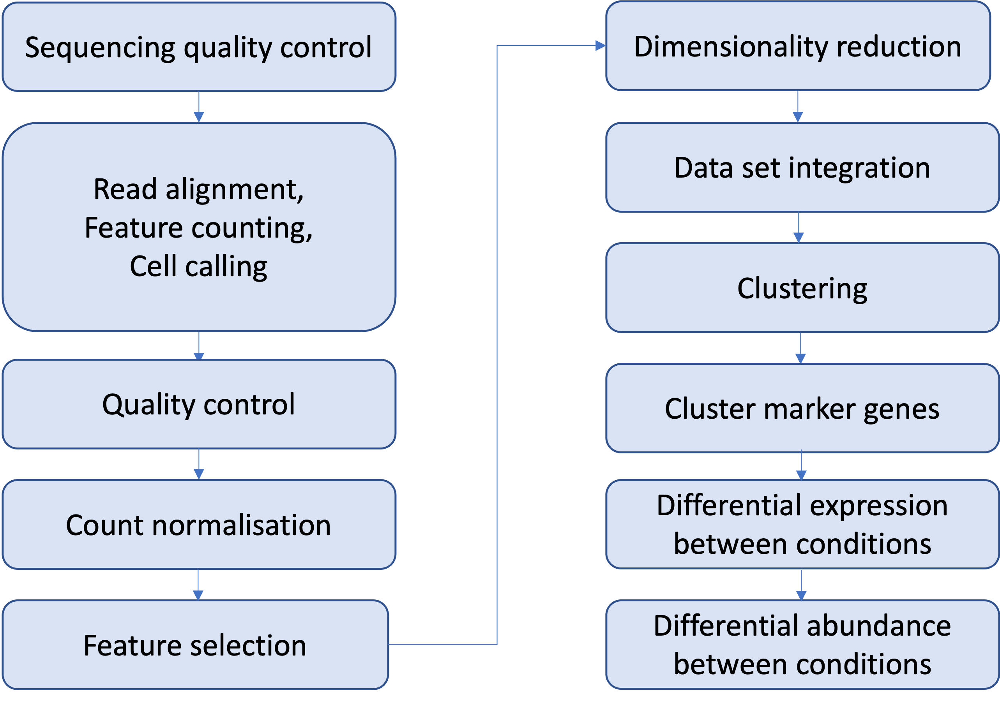
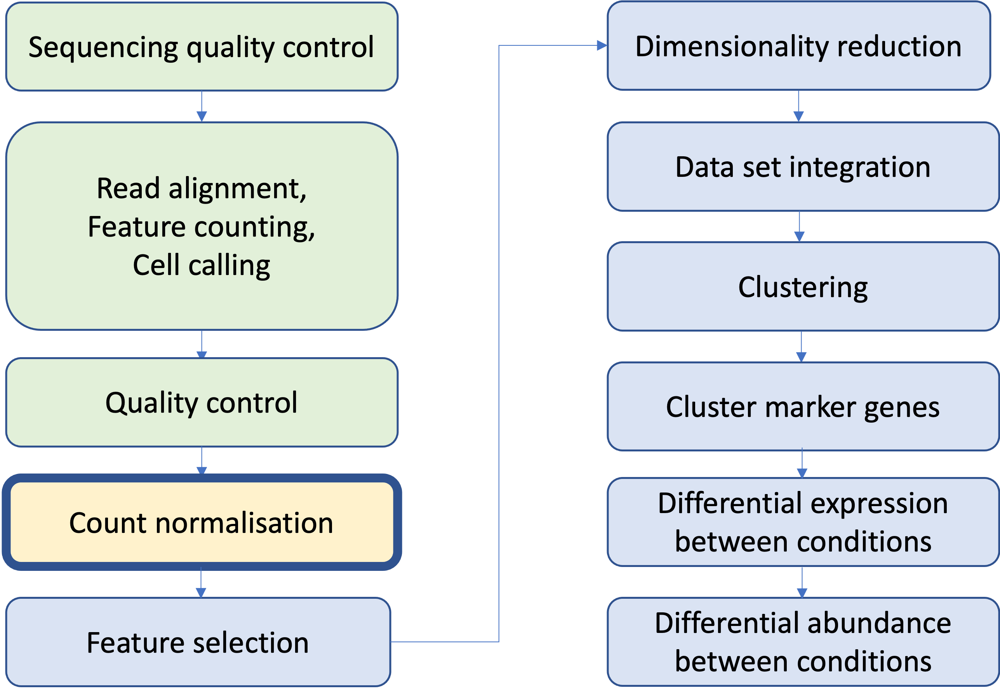
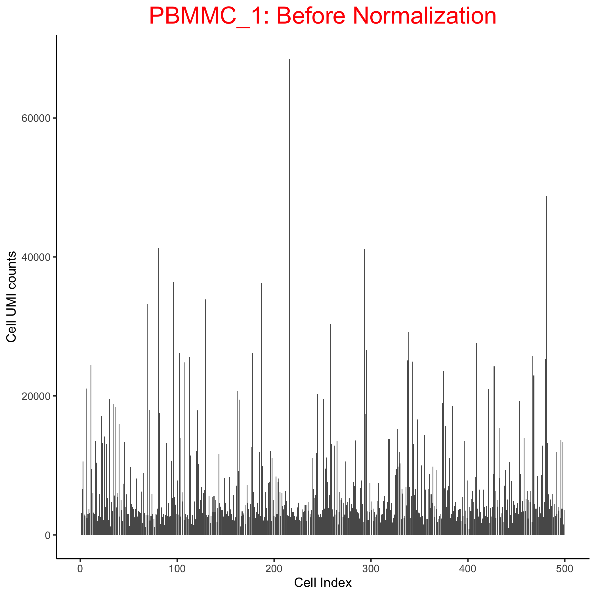
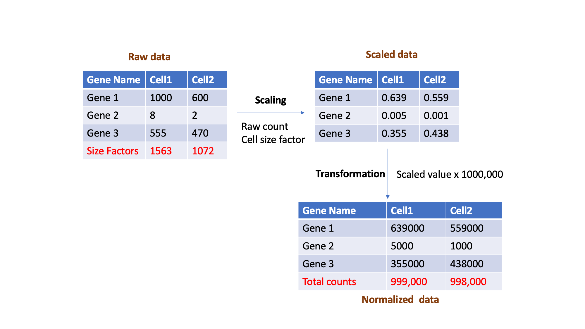
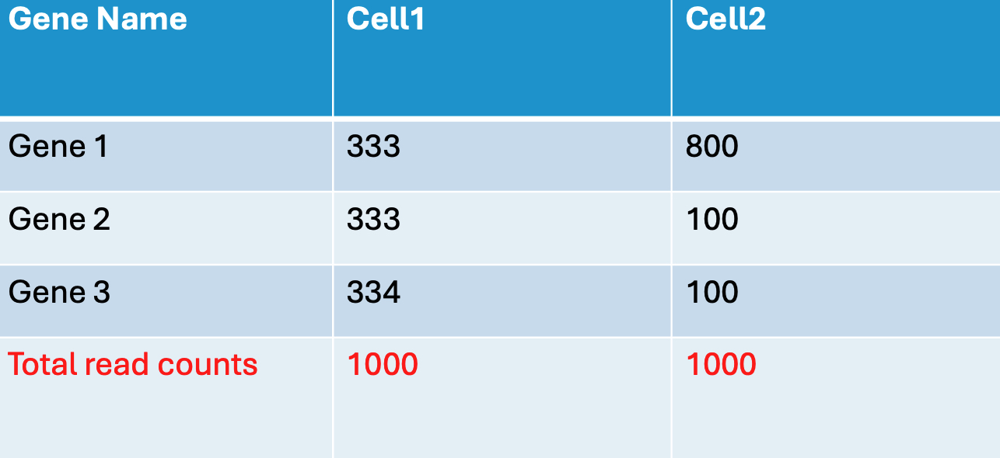
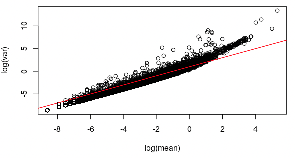

## Outline

* Motivation
* Biases
    * Depth bias
    * Composition bias
    * Mean-variance correlation
* Normalisation strategies
* Feature Selection


## Workflow

```{r echo=FALSE, out.width='60%', fig.align='center'}

```

## Workflow

```{r echo=FALSE, out.width='60%', fig.align='center'}

```

## Raw UMI counts distribution

```{r echo=FALSE, out.width='50%', fig.align='center'}

```

## Why do UMI counts differ among the cells?

* We derive biological insights downstream by comparing cells against each other.
* Differences in the total the UMI count of each cell make direct comparison of expression profiles between cells inappropriate.

* Why do total transcript molecules (UMI counts) detected between cells differ?
  * Biological:
    * Cell subtype differences - size and transcriptional activity, variation in gene expression
  * Technical: scRNA data is inherently noisy
    * Low mRNA content per cell
    * cell-to-cell differences in mRNA capture efficiency
    * Variable sequencing depth
    * PCR amplification efficiency

Normalization aims to reduce technical differences whilst preserving biological
differences, thus allowing meaningful comparison of expression profiles between
cells.

## Depth bias

Depth bias: Read differences between cells

```{r echo=FALSE, out.width='70%', fig.align='center'}

```

Simple library size normalization accounts for the depth bias

## Composition bias

* A small number of hightly expressed genes will account for most of the reads
* In this example, the total read counts are the same across the cells
* Gene 1 contributes 80% of reads in cell2, leaving other genes with fewer read counts.

```{r echo=FALSE, out.width='60%', fig.align='center'}

```

* Library size normalization can not correct composition bias.


## Mean-variance correlation

Mean and variance of raw counts for genes are correlated

More highly expressed genes tend to look more variable because larger numbers result in higher variance

```{r echo=FALSE, fig.align='center', out.width= "70%"}

```

## Mean-variance correlation

Mean and variance of raw counts for genes are correlated

More highly expressed genes tend to look more variable because larger numbers result in higher variance

A gene expressed at a low level tends to have a low variance across cells:

<pre class="code-box">   
var(c(2, 4, 2, 4, 2, 4, 2, 4)) = 1.14
</pre>
A gene with the same proportional differences between cells, but expressed at a higher level will have higher variance:

<pre class="code-box">
var(c( 20, 40, 20, 40, 20, 40, 20, 40)) = 114.29
</pre>

## General principle behind normalisation

Normalization has two steps

1. Scaling
    * Calculate size factors or normalization factors that represents the relative depth bias in each cell
    * Scale the counts for each gene in each cell by dividing the raw counts with cell specific size factor
  
2. Transformation: Transform the data after scaling
    * log2 (e.g. Deconvolution)
    * Pearson residuals (eg. sctransform)

## Bulk RNAseq methods are not suitable for scRNAseq data

e.g. DESeq's size factor

* For each gene, compute geometric mean across cells
* For each cell
    * compute for each gene the ratio of its expression to its geometric mean,
    * derive the cell's size factor as the median ratio across genes.
* Not suitable for sparse scRNA-seq data as the geometric mean is computed on non-zero values only.

## SCTransform

Simple log transformation of the counts is not ideal for scRNA-seq data as it
as it fails to fully account for the mean-variance relationship in the data, and
can lead to overemphasis of lowly expressed genes.

The primary goal of scTansform is to achieve improved variance stabilization.

## SCTransform

Simple log transformation of the counts is not ideal for scRNA-seq data as it
as it fails to fully account for the mean-variance relationship in the data, and
can lead to overemphasis of lowly expressed genes.

The primary goal of scTansform is to achieve improved variance stabilization.

Steps:

1. Model the "expected counts" for each gene using a regularized negative
binomial regression model

    $$
    \log(\text{expected count}) = \log(\text{sequencing depth}) \times \beta + \text{other factors}
    $$

2. Calculate Pearson residuals from the negative binomial regression model -
these residuals become the normalized values for downstream analysis.

```
"This procedure omits the need for heuristic steps including pseudocount
addition or log-transformation and improves common downstream analytical tasks
such as variable gene selection, dimensional reduction, and differential
expression. We named this method sctransform."
```

## SCTransform

1. Model the "expected counts" for each gene using a regularized negative
binomial regression model

2. Calculate Pearson residuals from the negative binomial regression model -
these residuals become the normalized values for downstream analysis.

$$\text{Pearson residual} = \frac{\text{Observed value} - \text{Expected value}}{\sqrt{\text{Expected variance}}}$$

If a gene has exactly the expression level we’d expect based on the model → residual = 0

If a gene is expressed higher than expected → positive residual

If a gene is expressed lower than expected → negative residual

## SCTransform

1. Model the "expected counts" for each gene using a regularized negative
binomial regression model

2. Calculate Pearson residuals from the negative binomial regression model -
these residuals become the normalized values for downstream analysis.

$$\text{Pearson residual} = \frac{\text{Observed value} - \text{Expected value}}{\sqrt{\text{Expected variance}}}$$

These residuals have several desirable properties for downstream analysis:

* Standardized scale: All genes end up on the same scale regardless of their
  expression level

* Variance stabilization: Unlike raw counts, these residuals have roughly the
  same variance across all expression levels. 

* Interpretation: Positive residuals mean higher-than-expected expression;
  negative means lower-than-expected. A residual of +2 means “this gene is
  expressed about 2 standard deviations higher than expected”.  

## SCTransform

Really Useful Website:

<pre class="code-box">
https://biostatsquid.com/sctransform-simple-explanation/
</pre>

## Inside SCTransform there is a 'selection' of the the most variable genes.

By default these are used for downstream dimensionality reduction and clustering
(although in most cases you can change this)

* Which genes should we use for downstream analysis?

Select genes which capture biologically-meaningful variation, while reducing the number of genes which only contribute to technical noise


## Recap

* We get different total counts for each cell due to technical factors (depth bias)
* A simplistic library size normalisation (e.g. CPM) removes a large part of this bias
* However, composition bias causes spurious differences between cells
* Early methods developed for bulk RNA-seq are not appropriate for sparse scRNA- seq data.
* The SCTransform method uses a regularized negative binomial regression model to estimate size factors, and applies a variance stabilizing transformation to the scaled counts.
* This accounts for both sequencing depth (library size) and gene-specific effects simultaneously.


