## Single Cell RNAseq Analysis Workflow

```{r echo=FALSE, out.width='60%', fig.align='center'}
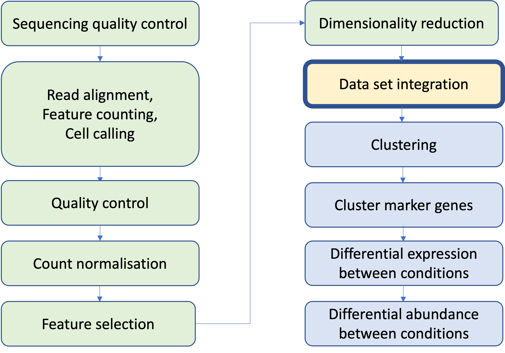
```

## Why do we need to think about data integration?

- There are generally three reasons for this
  - **Batch effects**: 
    - Process samples in batches, different dates, different technicians, different technologies etc
  - **Biological effects**: 
    - A study involving male and female subjects with the same disease will often have gender-specific clusters when visualized using t-SNE. 
    - Need to integrate to remove the "gender" effect and to identify shared cell types.
  - **Distinct cellular modalities**: 
    - For examples for the same study one may profile single cell level transcriptomics or spatial transcriptomics or single cell's immunophenotype
    - Integration is required to to get comprehensive functional understanding of these data sets.
    
  

## Data Integration Workflow

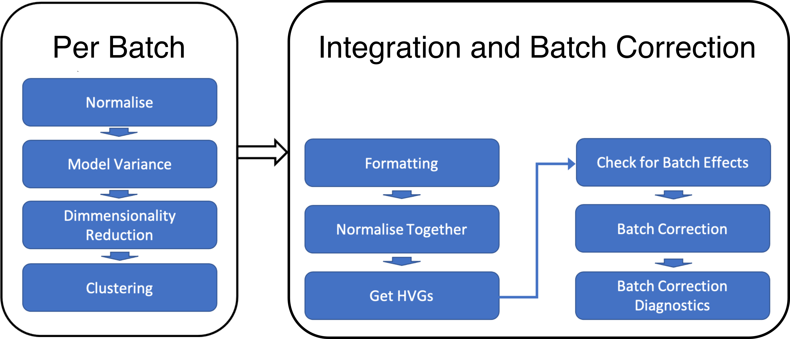

## Formatting our data

A few ways our data can be arranged (software-dependent too)

- one large Seurat object containing many samples

- many single-sample Seurat objects, QC'd in isolation

- multiple large Seurat objects with multiple samples

- objects from different software packages (eg. Seurat, SingleCellExperiment, Scanpy)


Important we make sure things match up

- Different bioconductor/package versions

- Different analysts may have formatted things slightly differently


## Cellranger `aggr`

A useful quick look

```{r echo=FALSE, out.width='60%', fig.align='center'}
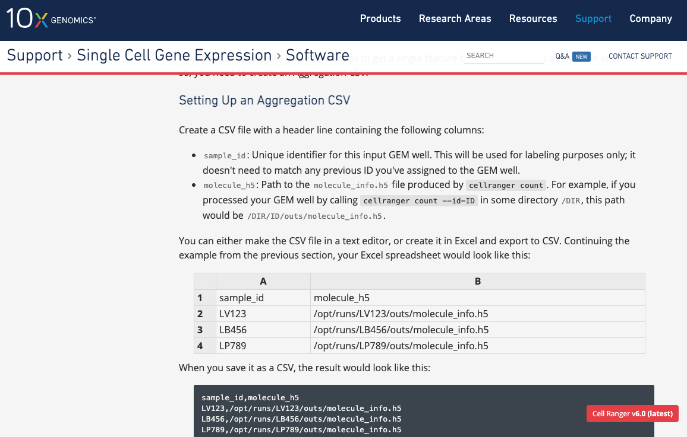
```

## Loupe Browser and LoupeR

10X provides software for viewing your cellranger outputs. On a single sample level it can be useful for quick checks but on the output of `cellranger aggr` it can be valuable to check an experiment has worked before spending large amounts of time with analysis. Especially if you are working in collaboration with a wet lab researcher who may not have the computational skills to do this themselves.

10X also provides a package called LoupeR which can be used as an add on to Seurat to pass filtered or more processed data back for interactive viewing in the Loupe Browser. 

## Checking for batch effects

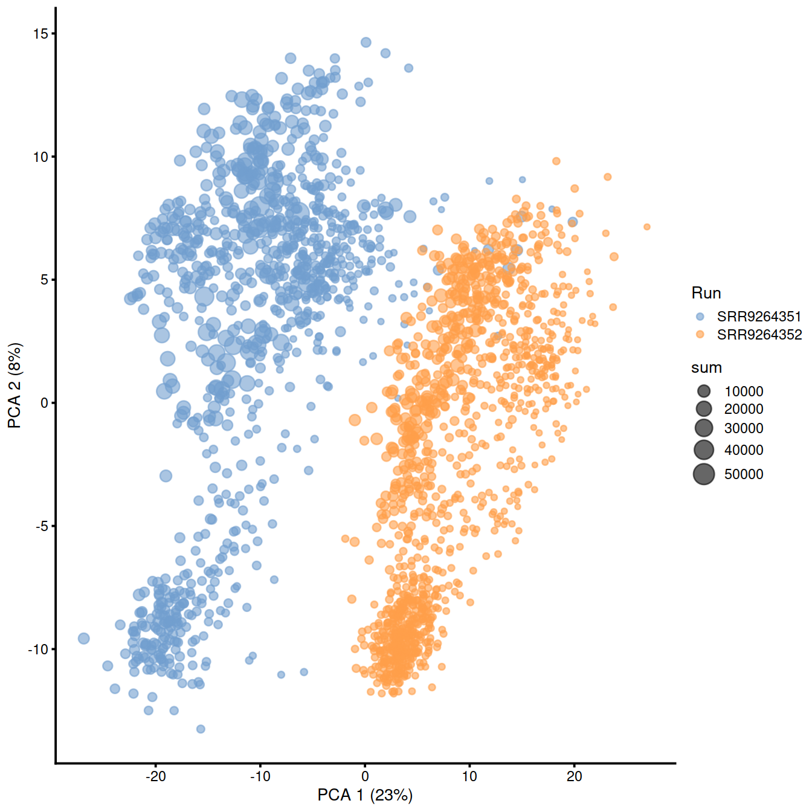
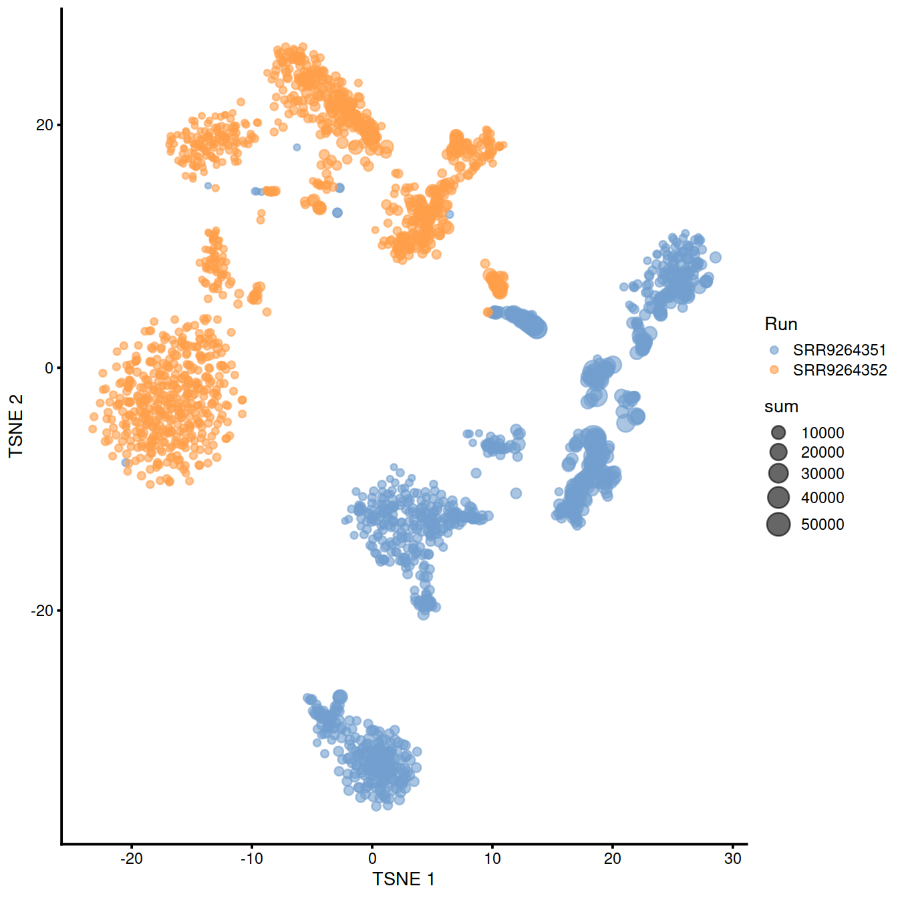
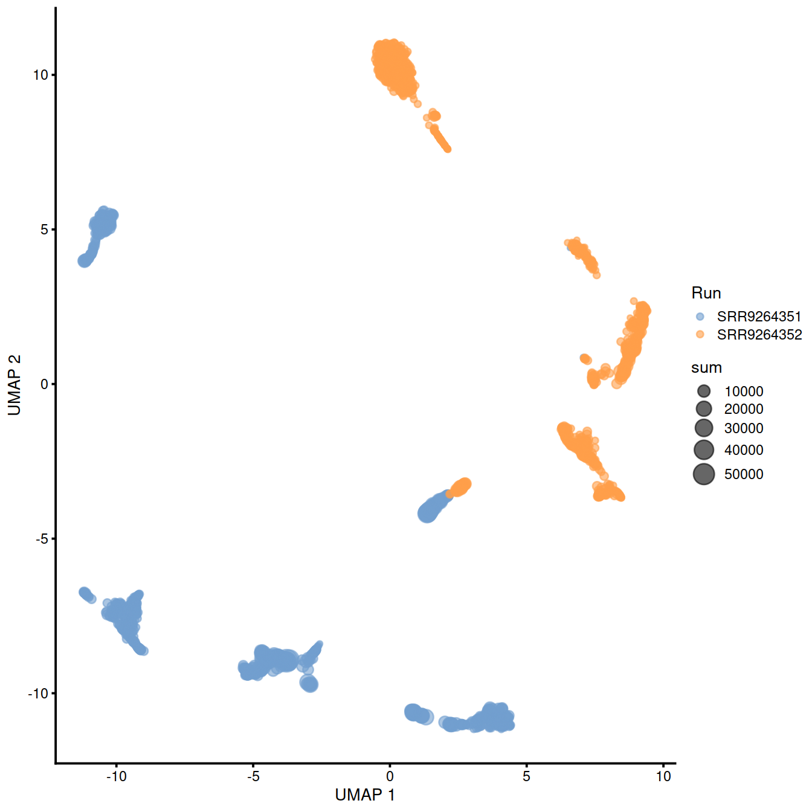

## Batch Corrections

- Gaussian/Linear Regression - removeBatchEffect (limma), comBat (sva), rescaleBatches or regressBatches (batchelor)

- Harmony - [Korsunsky et al 2019](https://www.nature.com/articles/s41592-019-0619-0)

  - IntegrateLayers (Seurat) or RunHarmony (Harmony)

- Mutual Nearest Neighbours (MNN) correction - [Haghverdi et al 2018](https://www.nature.com/articles/nbt.4091)

  - mnnCorrect (batchelor)
  
  - FastMNN (batchelor/SeuratWrappers)

- And [many more](https://www.scrna-tools.org/tools?sort=name&cats=Integration)! 

  - Different methods may have strengths and weaknesses

  - [Benchmark studies](https://theislab.github.io/scib-reproducibility/) can be used as a reference to choose suitable method

## Harmony {#less_space_after_title}

```{r echo=FALSE, out.width='60%', fig.align='center'}
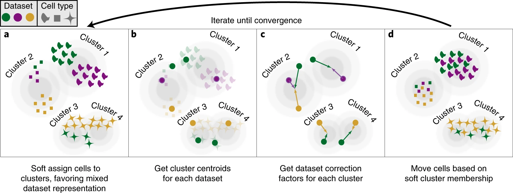
```
PCA embeds cells into a space with reduced dimensionality. Harmony accepts the cell coordinates in this reduced space and runs an iterative algorithm to adjust for dataset specific effects. 

* A, Harmony uses fuzzy clustering to assign each cell to multiple clusters, while a penalty term ensures that the diversity of datasets within each cluster is maximized. 

* B, Harmony calculates a global centroid for each cluster, as well as dataset-specific centroids for each cluster. 

* C, Within each cluster, Harmony calculates a correction factor for each dataset based on the centroids. 

* D, Finally, Harmony corrects each cell with a cell-specific factor: a linear combination of dataset correction factors weighted by the cell’s soft cluster assignments made in step a. Harmony repeats steps a to d until convergence. The dependence between cluster assignment and dataset diminishes with each round. Datasets are represented with colors, cell types with different shapes.


## Harmony

Assumptions:

1. The expected input is a matrix normalised for library size.
2. Cells are embedded in low dimensional space (PCA).
3. The low-dimensional nearest-neighbor structure induced by Euclidean distance should be preserved with common similarity metrics such as cosine similarity and correlation. Very unlikely to be violated in real scRNAseq data.

Known Limitations: 

1. Performance on small dataset sizes is poor 
2. Harmony assumes a linear adjustment is required which may not capture more complex non-linear effects (FastMNN can capture non-linear effects but is more computationally intensive).
3. It's default correction can be quite harsh so when batch effects are small, parameters need to be changed or a different method used.


## Checking our correction has worked

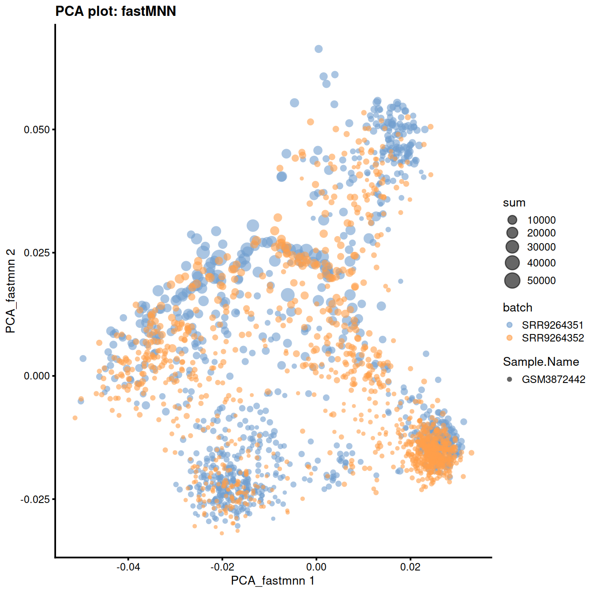
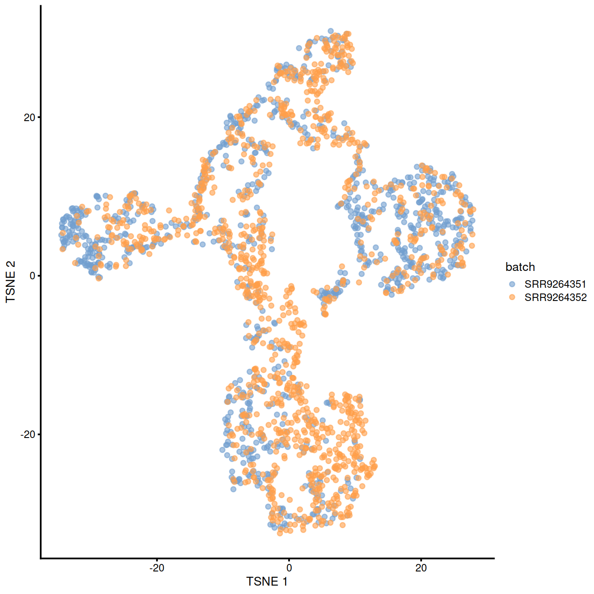
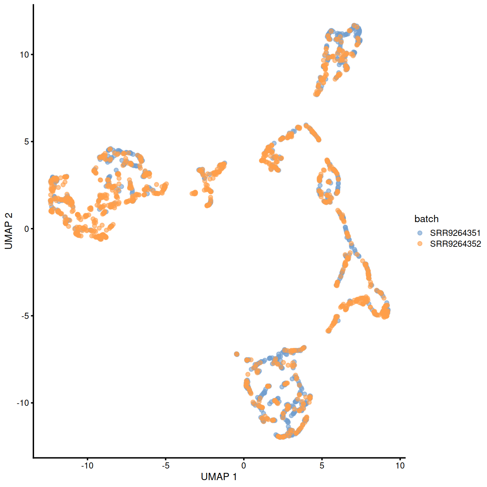

## Checking our correction has worked

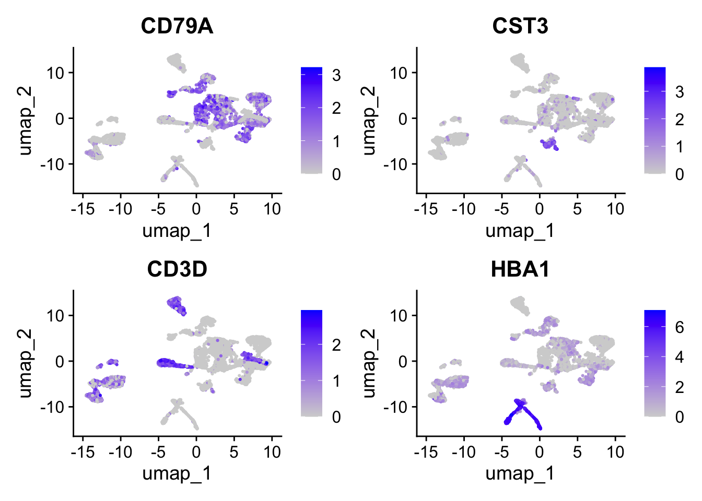
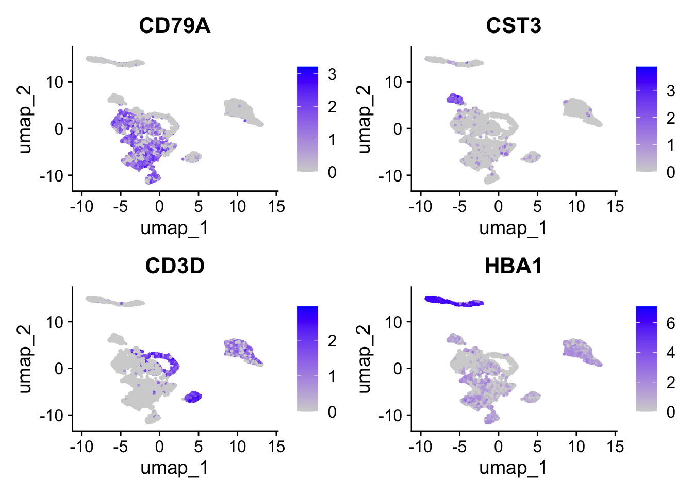

## Checking our correction hasn't over worked

- If you use any correction algorithm in the absence of a batch effect, it may not work correctly

- It is possible to remove genuine biological heterogeneity

- In reality the absence of any batch effect would warrant further investigation.

## Checking our correction hasn't over worked

- One way to measure if we have retained heterogeneity is to look at the agreement between clusters before and after correction
- Adjusted Rand Index 
- HIGH = GOOD (eg. 0.8 = within batch variation is retained)

<div>

```{r echo=FALSE, out.width='30%', fig.align='center'}
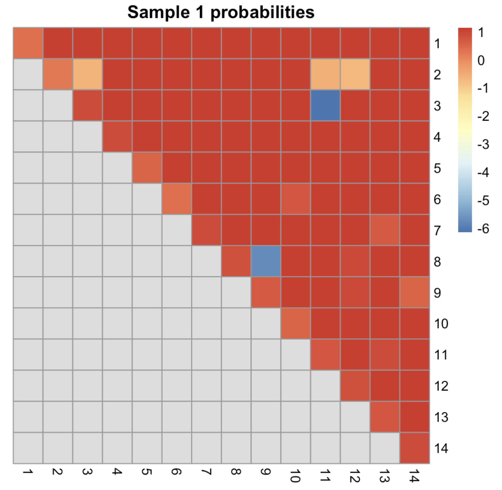
```

- ARI can also be broken down into per-cluster ratios

## Using the corrected values

The value in batch correction is that it enables you to see population heterogeneity within clusters/celltypes across batches. 

  - Also increases the number of cells you have
  
However the corrected values should not be used for gene based analysis eg. DE/marker detection.

  - Correction may have introduced artificial agreement between batches on the gene level.
  
  - Integration inherently introduces dependencies between data points which can violate assumptions of statistical tests.

