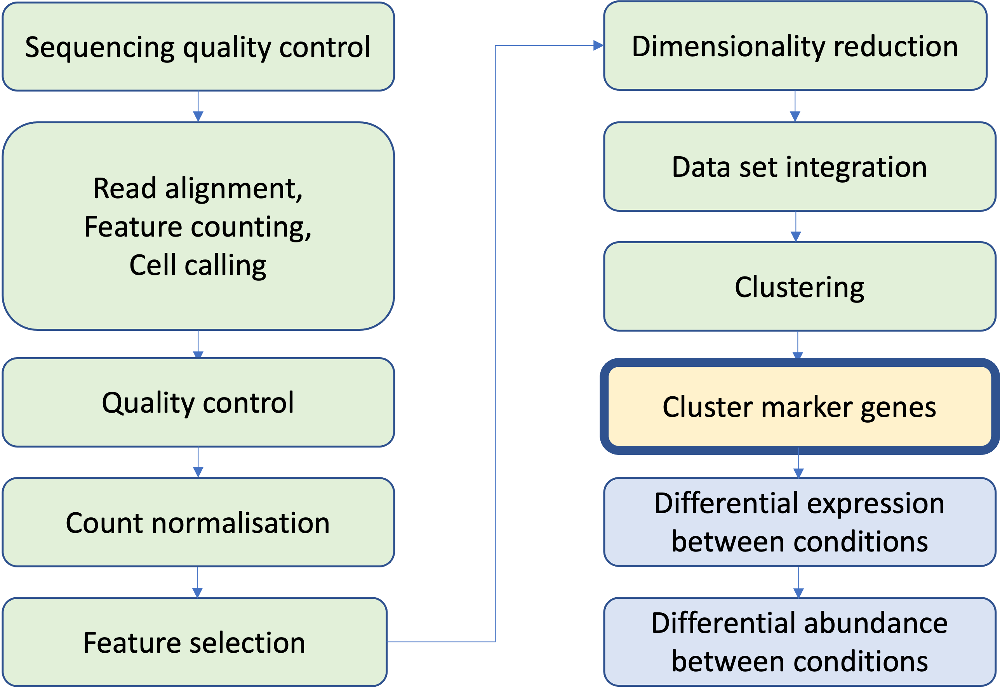
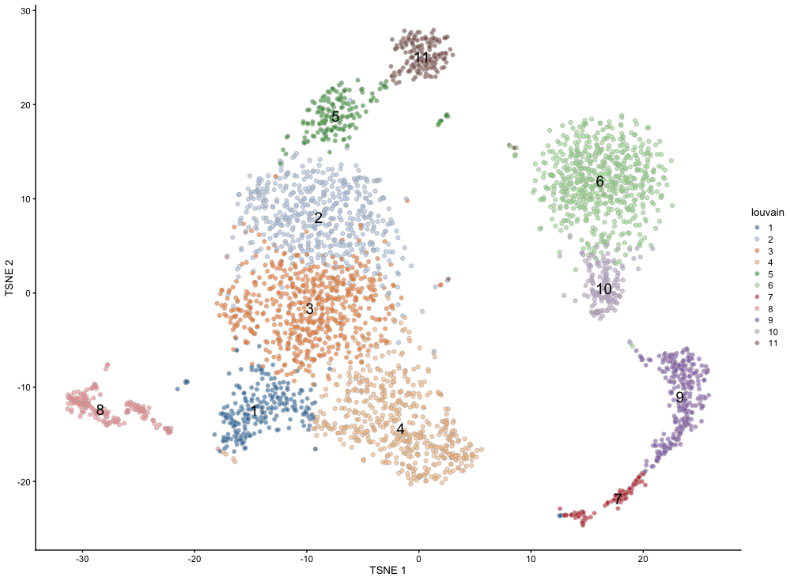

## Single Cell RNAseq Analysis Workflow

```{r echo=FALSE, out.width='60%', fig.align='center'}

```

## Identifying Cluster Marker Genes

```{r echo=FALSE, out.width= "50%", out.extra='style="float:left; padding:30px"'}

```

Our goal is to identify genes that are differently expressed between clusters

Calculate effect sizes that capture differences in expression level between the cluster of interest and the rest of the clusters.

We can also carry out the comparison pariwise between clusters, which can be useful for identifying genes that are differentially expressed between specific clusters.

## Wilcoxon Rank Sum Test

a non-parametric, independent two-sample test used to determine if two independent groups are drawn from populations with different medians or distributions

Robust to outliers and does not assume normality, making it suitable for single-cell RNA-seq data, which often contains many zero counts and can be skewed.

Simple and fast

Not suitable when cell numbers are low or when there are many zero counts. eg. < 100 cells


## The **FindMarkers** function

We can either compare one cluster to all the other clusters, or we can compare one cluster to another specific cluster.

```r
FindMarkers(seurat_object, 
ident.1 = "cluster_of_interest", 
ident.2 = NULL, 
test.use = "wilcox")
```
The output is a data frame

The **FindAllMarkers** function allows us to perform the sme test for all clusters at once.

## The **FindMarkers** function

The output dataframe has a row for each gene and columns:

* p_val: p-value from the statistical test
* avg_log2FC: log2 fold change in mean expression between the two groups
* pct.1: percentage of cells in the cluster of interest that express the gene
* pct.2: percentage of cells in the other cluster(s) that express the gene
* p_val_adj: adjusted p-value for multiple testing

We can use the fold change and adjusted pvalue to rank our genes but we should not claim significance from the pvalues.

## So, what's really important? 

* Strictly speaking, identifying genes differentially expressed between clusters is statistically flawed, since the clusters were themselves defined based on the gene expression data itself. Validation is crucial as a follow-up from these analyses.

* Using cells as replicates in this context is also statistically flawed, since the cells are not independent samples. This is a common issue in single cell RNA-seq analysis, and it can lead to inflated false positive rates if not properly accounted for. We will therefore not trust the pvalues from these analyses to indicate significance, and instead focus on ranking by the effect sizes (e.g. log fold change).

* Do not use batch-integrated expression data for calculating marker gene scores, instead, **include batch in the statistical model** (the `scoreMarkers()` function has the `block` argument to achieve this).

* Normalization strategy has a big influence on the results in differences in expression between cell and between clusters.

* A lot of what you get might be noise. Take two random set of cells and run DE and you probably with have a few significant genes with most of the commonly used tests.

* It’s important to assess and **validate the results**. Think of the results as
hypotheses that need independent verification (e.g. microscopy, qPCR)
