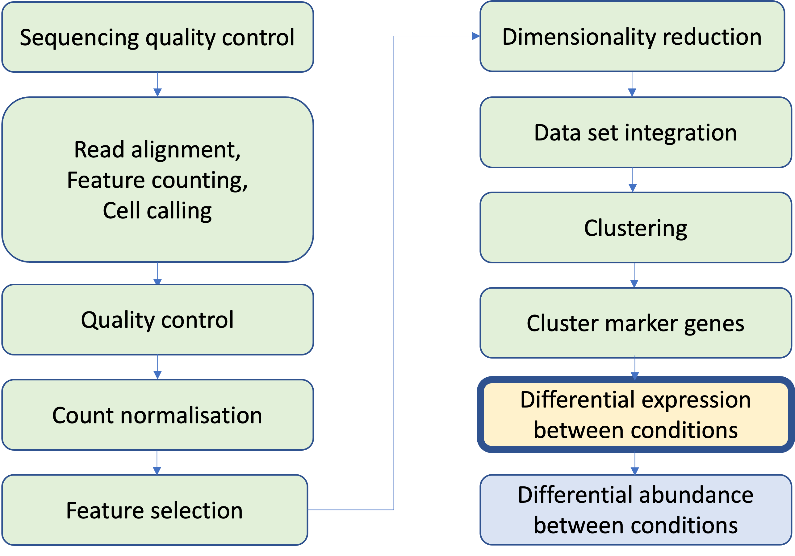
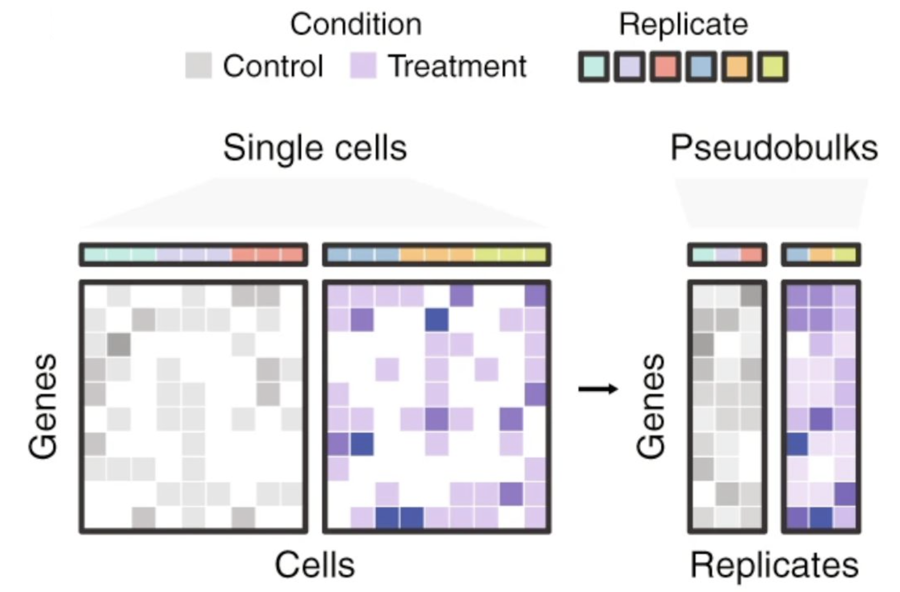

## Single Cell RNAseq Analysis Workflow

```{r echo=FALSE, out.width='60%', fig.align='center'}

```

## Outline

Clusters and/or cell types have been identified, we now want to compare sample groups:

* Differential expression - Differences in expression between sample group within a biological state.

* Differential abundance - Differences in cell numbers between sample groups within a biological state.

## Differential Expression

Replicates are samples not cells:

* Single cells within a sample are not independent of each other
* Using cells as replicates amounts to studying variation inside an individual
* May violate assumptions of independence and lead to inflated false positives
* We want to study variation across a population

Are the genes up or down regulated between treated vs control or wildtype vs mutant or healthy vs diseased etc. ?

## The Pseudo-bulk Method

* Create pseudo-bulk samples by summing raw counts across cells for each sample

```{r echo=FALSE, out.width='60%', fig.align='center'}

```
Once the pseudo-bulk matrix is generated, we can use any bulk RNA-seq DE method to perform the analysis, such as DESeq2, edgeR, limma-voom etc.

## Using FindMarkers()

We should remove pseudosamples with created from very few cells eg. < 20 cells

We should remove genes that are lowly expressed
  * reduces computational work,
  * improves the accuracy of mean-variance trend modelling
  * decreases the severity of the multiple testing correction
  * filter: log-CPM threshold in a minimum number of samples, smallest sample group

Seurat function **FindMarkers()** can also be used for differential expression.

The default Wilcoxon Rank Sum test was used to find cluster markers but the function is also a wrapper for several other methods, including MAST, DESeq2 and limma. 

We can choose the method with the **test.use** parameter.

We will use **DESeq2**

## DESeq2 method

DESeq2 will 'normalise' our pseudocount data to account for composition biases and differences in sequencing depth between samples.

Main Steps:

1. Estimate size factors to account for differences in sequencing depth between samples
2. Estimate dispersion parameters for each gene to model the variance of counts across samples
3. Fit a negative binomial generalized linear model (NB GLM) for each gene to
   * model the relationship between gene expression and experimental conditions
   * Use the Wald test to determine if our fold change is significant
   * run a B-H Multiple testing correction to control the false discovery rate (FDR)
