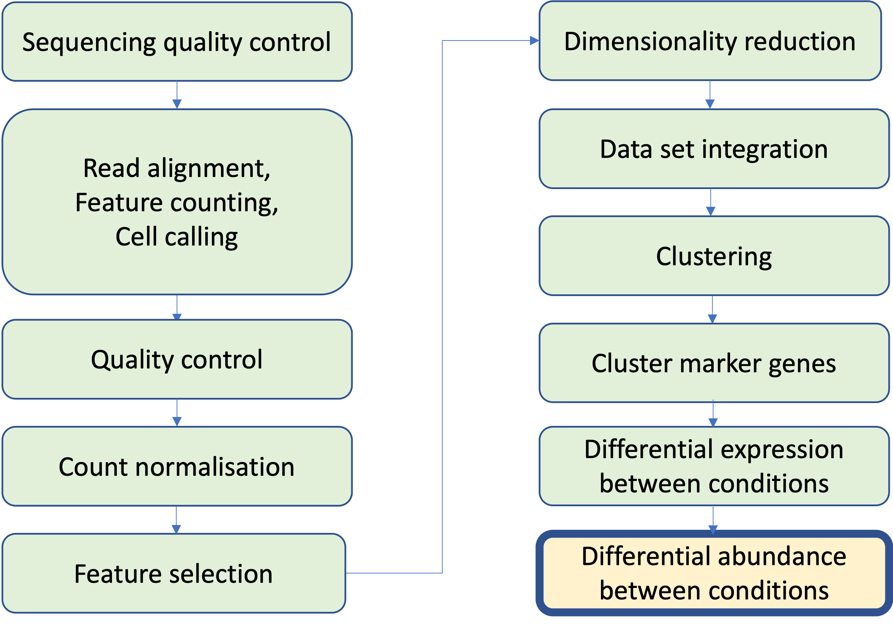
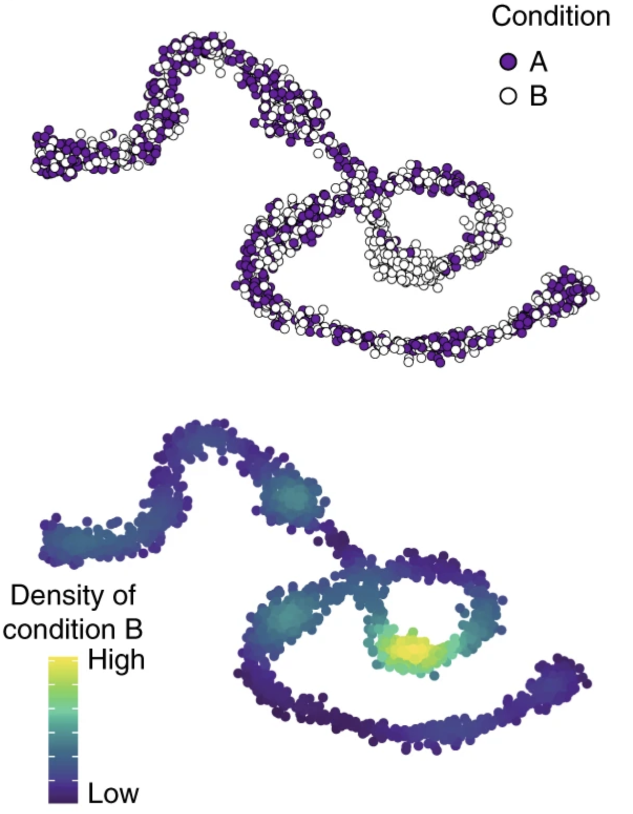
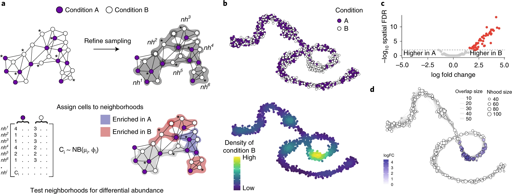
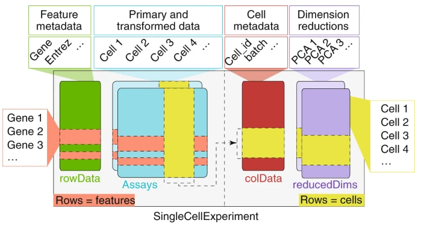

## Single Cell RNAseq Analysis Workflow

```{r echo=FALSE, out.width='60%', fig.align='center'}

```

## Differential Abundance

Aim:

- test for significant changes in grouped cell abundance across conditions

Example:

- which cell types are depleted or enriched upon treatment?

## Differential Abundance - Milo

- Most methods require defined clusters as input. Assigning cells to discrete clusters in context of continuous differentiation, developmental or stimulation trajectories.

- Methods that don't require clusters also don't model variability in cell numbers among replicates or can only carry out pairwise comparisons.

```{r echo=FALSE, , fig.align='center', out.width= "25%"}

```

- Can be used for complex experimental designs

## Differential Abundance - Milo

```{r echo=FALSE, , fig.align='center', out.width= "100%"}

```

## Differential Abundance - Milo

Steps:

- Construct KNN graph

  - rescales UMI count by per-cell sequencing depth
  - log transforms 
  - uses PCA
  - calculates Euclidean distance between cells and its k nearest neighbour in PC space
  
- Defines Cell Neighbourhoods by sub-sampling the graph to
identify useful “index cells” (for computational efficiency)

- Counts cells in Neighbourhoods

- Tests for DA in Neighbourhoods

- Does a multiple testing correction (Spacial FDR)

- Visualises the outputs with our UMAP embeddings

## Conversion to SingleCellExperiment {#less_space_after_title}

```{r echo=FALSE, out.width='50%', fig.align='center'}

```

- Milo is implemented in R and uses the SingleCellExperiment class as input

- We will have to convert our **Seurat** object to a **SingleCellExperiment** object

- Seurat has a function for this called `as.SingleCellExperiment()`

- The SCE object also has slots for the differnt elements of our data
  - `colData` for the metadata
  - `assays` for the count data
  - `reducedDims` for the dimensionality reduction embeddings
  